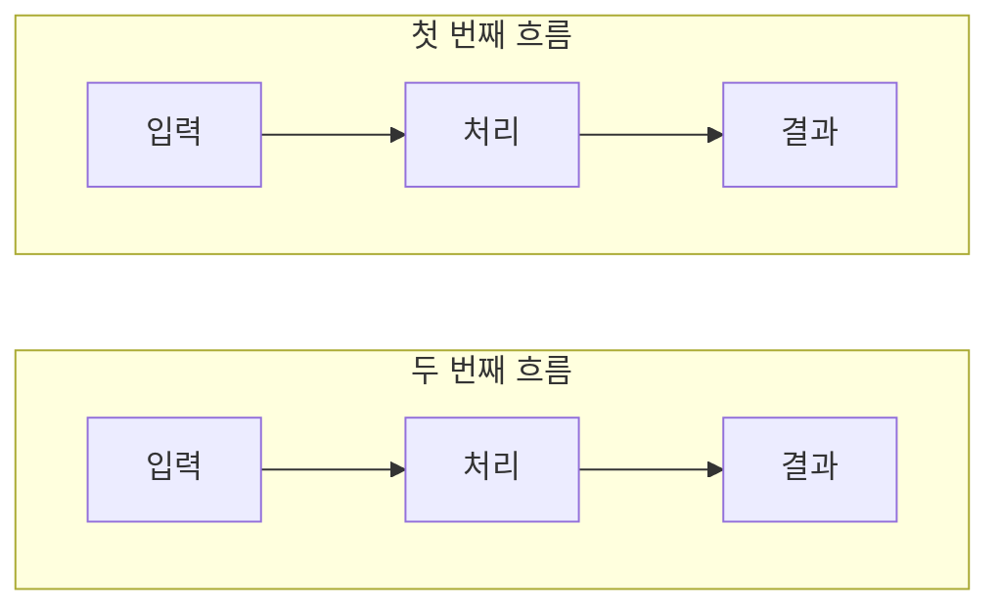

```mermaid
---
config:
  layout: elk
  theme: base
  elk:
    edgeRouting: ORTHOGONAL
  themeVariables:
    primaryColor: "#fbfcfd"
    primaryBorderColor: "#e6e8ea"
    fontFamily: "Pretendard, sans-serif"
    clusterBkg: "#fbfcfd"
    clusterBorder: "#d6d7da"
---
flowchart LR
  ...
```

# 블로그 포스트 작성 가이드

이 문서는 포트폴리오 블로그(`posts/`)의 포스트 작성 규칙을 정의한다.
직접 경험한 문제를 명확하게 전달하는 것이 목표다.

## 📝 문체 가이드

### 1. 기본 문체

모든 포스트는 격식체(`~입니다`, `~합니다`, `~됩니다`)로 쓴다. 포스트 안에서 다른 문체를 섞지 않는다.

> 독자에게 설명하듯 쓰되, 과하게 친근하거나 딱딱하지 않은 톤을 유지한다.
> event-delegation, metric-formatting, vite-host-secure-cookie 포스트가 이 문체를 따른다.

**예외**:

- 코드 주석과 텍스트 흐름도는 짧게 끝내기 위해 명사형이나 건조체(`~한다`)를 쓸 수 있다
- `>` 인용구는 핵심을 짧게 강조하는 용도이므로 건조체를 허용한다
- frontmatter의 `desc`는 목록에 표시되는 요약이므로 건조체(`~정리했다`)로 쓴다

**공통 규칙**:

- `~요`, `~이에요`, `~예요` 문체는 사용하지 않는다
- 독자에게 묻는 질문형 문장(`~인가요?`, `~있으신가요?`, `~일까?`)으로 문단을 시작하거나 끝내지 않는다
- 경험하지 않은 내용을 경험한 것처럼 쓰지 않는다
- 불확실한 내용에만 `~것 같다`, `~인 듯하다`를 사용한다
- 확인한 내용은 `확인했다`, `발견했다`, `테스트해봤다`처럼 명확하게 쓴다

```markdown
❌ 이 방법이 효과적인 것 같다. (이미 측정으로 확인한 경우)
✅ 실제로 측정해보니 이 방법이 효과적이었다.

❌ 이 방법이 효과적인 것 같습니다. (이미 측정으로 확인한 경우)
✅ 실제로 측정해보니 이 방법이 효과적이었습니다.
```

### 2. 글의 구조

실제로 겪은 상황에서 출발한다. 추상적인 개념 설명부터 시작하지 않는다.
글의 성격에 따라 두 가지 구조 중 하나를 선택한다.

**트러블슈팅형** — 버그, 예상과 다른 동작을 해결한 글

```text
1. 문제 상황 — 어떤 상황에서 이 문제를 만났는가
2. 원인 분석 — 왜 이런 일이 발생하는가
3. 해결 — 어떻게 해결했는가
4. 정리 — 이 경험에서 얻은 것
```

**도입기형** — 라이브러리, 도구, 패턴을 도입하거나 마이그레이션한 글

```text
1. 도입 배경 — 기존 방식에서 어떤 불편이나 한계가 있었는가
2. 선택 이유 — 어떤 대안과 비교했고 왜 이것을 골랐는가
3. 적용 과정 — 프로젝트에 어떻게 적용했는가 (겪은 문제 포함)
4. 한계와 다음 단계 — 아직 남은 문제와 개선 계획
```

```markdown
✅ 좋은 도입부:

queryKey를 상수로 정리하는 리팩토링을 하면서 이해한 것들을 정리해봤다.

✅ 좋은 도입부:

로컬에서 개발하다 보면 터미널에 Local URL과 Network URL이 함께 출력됩니다.
Network URL로 접속한 뒤 로그인하고 새로고침하자, 로그아웃되는 현상을 발견했습니다.

❌ 나쁜 도입부 (개념 나열부터 시작):

이벤트 위임(Event Delegation)은 DOM 이벤트 처리 패턴 중 하나입니다.
이벤트 버블링을 활용하여 부모 요소에서 자식 요소의 이벤트를 처리합니다.

❌ 나쁜 도입부 (질문형):

로그인 후 새로고침하는 순간 로그아웃되는 경험, 있으신가요?
```

### 3. 문장 리듬

- 한 문단은 2~4문장으로 구성한다
- 같은 종결 형태(예: `~한다.`)를 세 문장 이상 연속 반복하지 않는다. `~된다`, `~이다`, `~했다`처럼 섞어 쓴다
- `>` 인용구로 핵심 개념이나 결론을 짧게 강조한다
- 실생활 비유는 사용하지 않는다 (건축가, 편지, 통역사 같은 비유 금지)

```markdown
✅ 인용구 활용:

> TanStack Query는 이걸 캐시로 해결한다.

> queryKey는 캐시를 식별하는 키다.
```

## 🎯 마크다운 작성 규칙

### 1. 강조 표현

백틱과 볼드체는 역할이 다르다.

- **백틱**: 코드에서 그대로 찾거나 입력할 수 있는 이름 (함수, 변수, 파일명, 명령어, 패키지명, HTTP 헤더·상태 코드)
- **볼드체**: 문장에서 꼭 기억해야 할 결론, 대비, 핵심 의미
- **평문**: React, Node.js, CSR, SSR 같은 일반 개념명

```markdown
❌ React는 `UI 라이브러리`다.
✅ React는 UI 라이브러리다.

❌ hydrateRoot를 호출한다.
✅ `hydrateRoot()`를 호출한다.

✅ 서버 렌더링은 **화면 표시 시점**과 **상호작용 가능 시점**을 분리한다.
```

**규칙**:

- 함수, 변수, 컴포넌트, 파일명, 경로, 명령어, 패키지명 → 백틱
- HTML 태그·속성, HTTP 헤더, 상태 코드 → 백틱
- 핵심 결론이나 대비 개념 → 볼드체 (한 문단에 1~2개만)
- 긴 문장 전체를 볼드체로 감싸지 않는다
- 볼드체 안에 백틱을 넣지 않는다

```markdown
❌ **함수 내부의 `username`**이 바뀐다.
✅ 함수 내부의 `username`이 **다른 값**으로 바뀐다.
```

### 2. 코드 블록

언어 표시를 항상 붙인다. 아래 목록 안에서 선택한다.

| 용도               | 언어 표시                |
| ------------------ | ------------------------ |
| 스크립트·컴포넌트  | `js`, `ts`, `tsx`, `jsx` |
| 마크업·스타일      | `html`, `css`            |
| 명령어·설정        | `bash`, `json`, `yaml`   |
| HTTP 요청·응답     | `http`                   |
| 텍스트 흐름도·트리 | `text`                   |
| 다이어그램         | `mermaid`                |

`typescript`, `javascript`처럼 긴 이름 대신 `ts`, `js`로 통일한다.

**코드 간결화 원칙**:

- 핵심 로직만 보여준다
- 반복되는 에러 처리, 보일러플레이트는 생략한다
- 주석은 독자가 놓치면 안 되는 지점에만 단다
- Before/After 비교가 효과적일 때 두 블록을 나란히 보여준다

````markdown
✅ 핵심만:

```ts
queryClient.invalidateQueries({
  queryKey: ["overview", "metrics", 1], // 이 키의 캐시를 만료시킨다
});
```

✅ Before/After:

```ts
// Before
useCoreQuery(["my-workspaces"], getMyWorkspaces);

// After
useCoreQuery(QUERY_KEYS.workspace.list(), getMyWorkspaces);
```
````

### 3. 다이어그램 선택 기준

흐름을 그림으로 보여줄 때는 먼저 어떤 방식이 맞는지 정한다.

| 상황                                  | 방식                      |
| ------------------------------------- | ------------------------- |
| 주체가 둘 이상이고 요청·응답이 오간다 | Mermaid `sequenceDiagram` |
| 분기가 있거나 여러 흐름을 비교한다    | Mermaid `flowchart`       |
| 한 주체의 단계 나열, 트리 구조        | 텍스트 흐름도             |

같은 내용을 텍스트 흐름도와 Mermaid로 중복해서 보여주지 않는다. 둘 중 하나만 쓴다.

### 4. Mermaid 다이어그램

다이어그램을 넣는 것보다 **실제 본문 너비에서 글자가 읽히는지**가 우선이다.

**내용 구성**:

- 바로 위 문단과 같은 내용을 반복하지 않는다
- 노드에는 문장을 넣지 않고 핵심 동작만 짧게 적는다
- 시간 순서나 서버·브라우저 간 왕복이 중요한 경우 `sequenceDiagram`을 사용한다

**배치와 가독성**:

- 여러 흐름을 한 줄에 나란히 배치해 글자가 작아지는 구성을 피한다
- 세 개 이상의 흐름을 비교할 때는 각 흐름을 위아래로 쌓고, 흐름 내부만 `direction LR`로 구성하는 방식을 우선 검토한다
- 가로로 길어져 SVG 전체가 축소된다면 노드 수와 문구를 줄이거나 세로로 배치한다
- PC뿐 아니라 좁은 화면에서도 노드와 라벨이 지나치게 축소되지 않는지 확인한다



**표준 config 템플릿**:

모든 Mermaid 다이어그램에 아래 config를 적용한다. 테마와 폰트를 포트폴리오 디자인과 맞추기 위해서다.

````markdown

````

**classDef 색상 규칙**:

`flowchart`에서 노드 역할이 구분될 때 아래 classDef를 사용한다. 색상 의미를 통일해야 같은 포스트 안에서 여러 다이어그램을 쓸 때 독자가 혼란을 겪지 않는다.

```text
classDef request  fill:#eff6ff,stroke:#7eb1f3,color:#004fa7   ← 요청·진입점
classDef decision fill:#e0f7f9,stroke:#00b5c5,color:#004fa7   ← 분기·조건
classDef process  fill:#c8e0ff,stroke:#7eb1f3,color:#004fa7   ← 처리·변환
classDef success  fill:#eff6ff,stroke:#1779e1,color:#004fa7   ← 성공·출력
classDef error    fill:#fff1f2,stroke:#f87171,color:#991b1b   ← 실패·에러
classDef storage  fill:#f5f0ff,stroke:#ab8be3,color:#4a1d96   ← 저장소·캐시
```

노드에 역할이 하나만 있을 때는 classDef 없이 기본 스타일을 쓴다.

**검증**:

- 로컬 페이지를 실제 콘텐츠 너비로 열어 글자 크기, 줄바꿈, SVG 비율을 눈으로 확인한다
- 다이어그램을 읽기 위해 확대하거나 가로 스크롤해야 한다면 구성을 다시 단순화한다
- 다이어그램 전후의 문단을 함께 읽고 설명이 중복되거나 흐름이 끊기지 않는지 확인한다

### 5. 텍스트 흐름도

한 주체의 단계 순서나 트리 구조는 `text` 코드 블록으로 표현한다.

````markdown
✅ 단계 흐름:

```text
① 브라우저 → http://192.168.0.18:5173/api/auth/reissue 요청 시도
② 브라우저 내부 판단: "HTTP + IP 주소 = 비보안 컨텍스트"
③ 브라우저: 쿠키를 요청에 포함시키지 않음
④ Vite 프록시 → 백엔드 API (쿠키 없이 전달)
⑤ 서버 응답 ← 401: "refreshToken이 없습니다"
```

✅ 트리 구조:

```text
[일반 DOM]
  ├── <span data-light>금융 용어</span>
  └── <div id="light-root">
       └── #shadow-root
            └── <TooltipUI />
```
````

### 6. 표

비교나 최종 정리에 표를 활용한다. 표는 3열 이내로 간결하게 유지한다.

```markdown
✅ 비교 표:

| 접속 방식           | 보안 컨텍스트 | Secure 쿠키 전송 |
| ------------------- | ------------- | ---------------- |
| https://            | ✅            | 전송함           |
| http://localhost    | ✅ (예외)     | 전송함           |
| http://192.168.0.18 | ❌            | 전송 안 함       |

✅ 정리 표:

| 제약                     | 해결                   |
| ------------------------ | ---------------------- |
| span이 동적으로 생성된다 | document 위임          |
| 공통 부모가 없다         | document 레벨에서 위임 |
```

### 7. 인용구와 Callout

`>` 인용구와 `<Callout>`은 역할을 나눠 쓴다.

| 요소                       | 용도                                   |
| -------------------------- | -------------------------------------- |
| `>` 인용구                 | 핵심 개념이나 결론을 한 문장으로 강조  |
| `<Callout type="warning">` | 따라 하다가 실수하기 쉬운 지점, 부작용 |
| `<Callout type="tip">`     | 본문 흐름 밖의 부가 팁, 대안           |
| `<Callout type="info">`    | 버전 차이, 환경 조건 같은 배경 정보    |

Callout은 한 섹션에 하나까지만 쓴다. 본문에서 꼭 읽어야 하는 내용은 Callout이 아니라 본문에 쓴다.

### 8. 섹션 구조

섹션은 **빈 줄과 헤딩으로만 구분한다.** `---`는 사용하지 않는다.
(frontmatter를 감싸는 `---`는 문법이므로 예외다.)

```markdown
## 대제목 (주요 흐름 단계)

### 소제목 (세부 내용)

## 다음 대제목
```

번호를 소제목에 활용할 수 있다.

```markdown
## 1. Local URL과 Network URL이 함께 출력되는 이유

### (1) 네트워크 인터페이스가 여러 개다

### (2) host: "0.0.0.0"이 하는 일
```

헤딩도 질문형 대신 서술형으로 쓴다.

## 🔗 MDN 링크 전략

HTTP 관련 용어, 헤더, 상태 코드 등에 MDN 문서 링크를 추가한다.

```markdown
✅ [`Last-Modified`](https://developer.mozilla.org/ko/docs/Web/HTTP/Headers/Last-Modified)
✅ [`304 Not Modified`](https://developer.mozilla.org/ko/docs/Web/HTTP/Status/304)
✅ [`Cache-Control`](https://developer.mozilla.org/ko/docs/Web/HTTP/Headers/Cache-Control)
```

**링크 추가 대상**:

- HTTP 헤더 (`Cache-Control`, `ETag`, `Set-Cookie`, `Last-Modified` 등)
- HTTP 상태 코드 (`200`, `304`, `401` 등)
- 주요 웹 API (`IntersectionObserver`, `navigator.clipboard` 등)
- 외부 참고 자료 (W3C 스펙, RFC 문서 등)

**주의**:

- 링크를 추가한 뒤 실제로 열어서 해당 문서로 연결되는지 확인한다
- 문서 안의 특정 위치로 가는 앵커(`#secure_쿠키` 등)는 문서 수정 시 깨지기 쉬우므로 꼭 필요할 때만 쓴다
- 같은 용어의 링크는 포스트에서 처음 등장할 때 한 번만 단다

## 🖼️ 이미지 활용

"상황 설명 → 이미지 → 해석" 순서로 배치한다. 이미지를 그냥 삽입하지 않는다.

```markdown
✅ 좋은 예시:

invalidate를 호출하면 해당 키의 캐시에 만료 표시가 붙고,
현재 구독 중인 쿼리가 있으면 즉시 refetch가 발생한다.


구독 중인 컴포넌트가 없는 경우에는 다음에 마운트될 때 새로 받아온다.
```

**규칙**:

- 마크다운 이미지는 `BlogImage`로 렌더링되며, alt 텍스트가 figcaption으로 표시된다. alt는 "무엇을 보여주는 이미지인지" 한 문장으로 쓴다
- 코드는 스크린샷이 아니라 코드 블록으로 넣는다. 이미지는 브라우저 화면, 리포트, 도구 UI처럼 코드로 옮길 수 없는 것에만 쓴다
- 같은 종류의 스크린샷이 여러 장이면 대표 한 장만 남긴다

**이미지 경로 규칙**:

```text
public/blog/{포스트-키워드}/{포스트-키워드}-01.png
```

## 📋 Frontmatter 형식

```yaml
---
title: "포스트 제목"
date: "YYYY-MM-DD"
desc: "포스트를 한 문장으로 설명. 블로그 목록에 표시된다."
tags: ["태그1", "태그2"]
---
```

- `title`: 겪은 문제나 얻은 것을 구체적으로 드러낸다. 도구 이름보다 프로젝트의 문제를 앞세운다. 질문형 제목은 쓰지 않는다
- `date`: 파일명(`YYYY-MM-DD-slug.mdx`)의 날짜와 일치시킨다
- `desc`: 어떤 문제를 어떻게 해결했는지 한 문장으로 요약한다. 본문 내용보다 과장하지 않는다
- `tags`: 기술명 위주, 3개 이내

## ✅ 작성 체크리스트

포스트 작성 완료 후 확인:

**문체**

- [ ] 건조체 또는 격식체 중 하나를 포스트 전체에서 일관되게 썼는가?
- [ ] `~요` 문체와 질문형 문장(도입부, 헤딩, 제목 포함)을 쓰지 않았는가?
- [ ] 직접 확인하지 않은 내용을 경험한 것처럼 쓰지 않았는가?
- [ ] 실생활 비유 없이 개념 자체로 설명했는가?
- [ ] 한 문단이 2~4문장이고, 같은 종결 형태가 세 번 이상 연속되지 않는가?

**구조**

- [ ] 추상적 개념 정의 대신 실제 경험한 상황에서 시작했는가?
- [ ] 트러블슈팅형 또는 도입기형 구조를 따랐는가?
- [ ] `---` 없이 빈 줄과 헤딩으로만 섹션을 구분했는가?
- [ ] 마지막에 표 또는 인용구로 핵심을 요약했는가?

**마크다운**

- [ ] 기술 용어는 백틱, 핵심 결론은 볼드로 구분했는가?
- [ ] 한 문단에 볼드가 2개 이하이고, 볼드 안에 백틱이 없는가?
- [ ] 모든 코드 블록에 허용 목록의 언어 표시가 붙어 있는가?
- [ ] 코드는 핵심 로직만 보여주고 보일러플레이트는 생략했는가?
- [ ] 다이어그램 선택 기준에 맞는 방식을 썼고, 같은 내용을 중복하지 않았는가?
- [ ] Mermaid를 사용했다면 표준 config 템플릿(elk layout, Pretendard)을 적용했는가?
- [ ] Callout을 용도에 맞게, 섹션당 하나 이하로 썼는가?

**링크와 이미지**

- [ ] HTTP 헤더·상태 코드·주요 웹 API에 MDN 링크를 추가하고, 실제로 열리는지 확인했는가?
- [ ] 이미지를 상황 설명 → 이미지 → 해석 순서로 배치했는가?
- [ ] 코드를 스크린샷이 아닌 코드 블록으로 넣었는가?
- [ ] 이미지 경로가 `public/blog/{키워드}/{키워드}-01.png` 형식을 따르는가?

**Frontmatter**

- [ ] title, date, desc, tags가 모두 채워져 있는가?
- [ ] date가 파일명의 날짜와 일치하는가?
- [ ] tags가 3개 이내인가?

## 🗂️ 프로젝트 구조

```text
posts/                  # MDX 블로그 포스트
  YYYY-MM-DD-slug.mdx

public/blog/            # 블로그 이미지
  {키워드}/
    {키워드}-01.png

components/
  home/                 # 홈 페이지 섹션 컴포넌트
  blog/                 # 블로그 포스트 전용 컴포넌트
    CodeBlock.tsx       # 코드 블록 (복사 버튼 포함)
    BlogImage.tsx       # 이미지 + figcaption
    Callout.tsx         # tip/warning/info 콜아웃 박스
    TableOfContents.tsx # ## 헤딩 기반 목차
    CopyLinkButton.tsx  # 페이지 URL 복사 버튼
  common/               # 공통 컴포넌트 (Navbar)

lib/posts.ts            # MDX 파싱 유틸 (getAllPosts, getPostBySlug, extractHeadings)
```

### MDX에서 사용 가능한 컴포넌트

```mdx
<Callout type="tip">팁 내용</Callout>
<Callout type="warning">주의 내용</Callout>
<Callout type="info">참고 내용</Callout>


```
