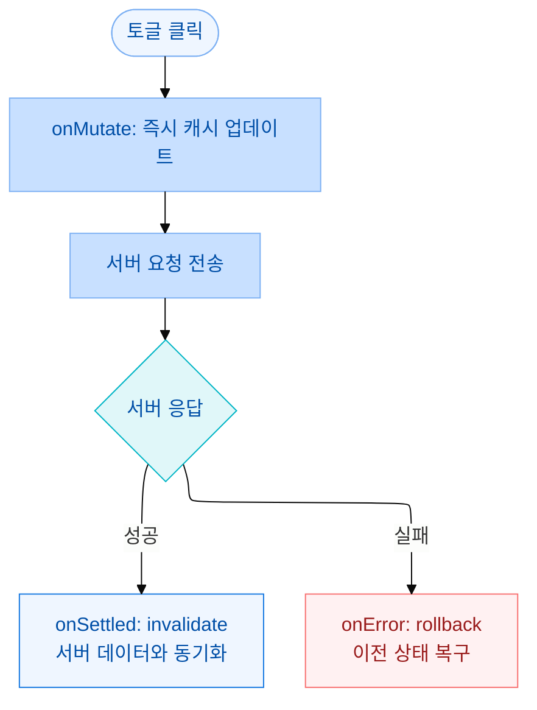

WithTime 프로젝트에서 알람 설정 화면을 개발하면서 토글 버튼의 반응 속도 문제를 고민했습니다.

알람 ON/OFF 토글을 누르면 서버에 요청을 보내고 응답을 받아야 UI가 변합니다. 서버 응답이 300ms라면 토글을 눌렀을 때 0.3초 동안 아무 반응이 없습니다. 이 지연이 사용자에게는 "버튼이 작동하지 않는 것처럼" 느껴집니다.


## 문제: 요청이 끝나야 UI가 바뀐다

```text
사용자: 토글 ON → 클릭
         ↓
       서버 요청 (300ms)
         ↓
       응답 수신 → setQueryData → UI 업데이트

→ 사용자는 0.3초간 반응 없는 버튼을 보게 된다
```

알람 설정은 실패할 확률이 낮습니다. 대부분 성공할 것이 거의 확실한데, 서버 응답을 기다려야 할 이유가 없습니다.

## 해결: Optimistic Update

`onMutate`에서 서버 요청 전에 즉시 UI를 업데이트합니다. 실패하면 `onError`에서 이전 상태로 돌립니다.

```ts
// src/hooks/settingAlarm/useAlarms.ts
export function useToggleAlarm() {
  const qc = useQueryClient()

  return useCoreMutation({
    mutationFn: ({ alarmId, enabled }: { alarmId: number; enabled: boolean }) =>
      toggleAlarm(alarmId, enabled),

    onMutate: async ({ alarmId, enabled }) => {
      // 진행 중인 refetch가 낙관적 업데이트를 덮어쓰지 않도록 취소
      await qc.cancelQueries({ queryKey: alarmKeys.all })

      // 롤백을 위해 현재 상태 저장
      const prev = qc.getQueryData(alarmKeys.list())

      // 즉시 UI 업데이트
      qc.setQueryData(alarmKeys.list(), (old: AlarmItem[] | undefined) =>
        old?.map((a) => (a.id === alarmId ? { ...a, enabled } : a)),
      )

      return { prev } // onError에서 롤백에 사용
    },

    onError: (_err, _vars, ctx) => {
      // 에러 시 저장해둔 이전 상태로 복구
      if (ctx?.prev) qc.setQueryData(alarmKeys.list(), ctx.prev)
    },

    onSettled: () => {
      // 성공·실패 무관하게 서버 실제 데이터와 동기화
      void qc.invalidateQueries({ queryKey: alarmKeys.all })
    },
  })
}
```

컴포넌트에서는 뮤테이션을 호출하기만 하면 됩니다.

```tsx
// src/components/settingTab/AlarmSetting.tsx
function AlarmSetting() {
  const { data: alarms } = useAlarms()
  const { mutate: toggleAlarm } = useToggleAlarm()

  return (
    <>
      {alarms?.map((alarm) => (
        <div key={alarm.id} className="flex items-center justify-between">
          <span>{alarm.label}</span>
          <ToggleSwitch
            checked={alarm.enabled}
            onChange={(enabled) => toggleAlarm({ alarmId: alarm.id, enabled })}
          />
        </div>
      ))}
    </>
  )
}
```

## 세 단계의 역할

**`onMutate` — 낙관적 업데이트**

서버 요청이 시작되기 직전에 호출됩니다. 여기서 두 가지를 합니다. 첫째, `cancelQueries`로 진행 중인 refetch를 취소합니다. 낙관적 업데이트 직후에 refetch 응답이 도착하면 업데이트가 덮어씌워질 수 있기 때문입니다. 둘째, `setQueryData`로 즉시 캐시를 업데이트합니다. 이 시점에 UI가 바뀝니다.

**`onError` — 롤백**

서버 요청이 실패하면 `onMutate`에서 반환한 `ctx`를 받아 이전 상태로 복구합니다. 사용자가 토글을 ON으로 바꿨는데 서버가 실패하면, 토글이 다시 OFF로 돌아갑니다.

**`onSettled` — 동기화**

성공이든 실패든 최종적으로 서버 데이터를 다시 조회합니다. 낙관적 업데이트는 "즉시 반응"을 위한 것이고, 실제 진실의 원천은 서버입니다.

## 결과



토글을 누르는 순간 즉시 반응합니다. 네트워크 지연이 있어도 사용자에게는 빠른 앱처럼 느껴집니다.

## 배운 것

Optimistic Update를 처음 쓸 때는 `onMutate`, `onError`, `onSettled` 세 핸들러의 역할이 헷갈렸습니다.

- `onMutate`: "낙관적으로" 캐시를 미리 바꿈 + 롤백 컨텍스트 저장
- `onError`: 실패 시 되돌림
- `onSettled`: 최종 서버 상태와 동기화

`cancelQueries`가 왜 필요한지도 처음에 몰랐습니다. 실제로 이를 빠뜨리고 테스트했더니, 드물게 refetch 응답이 낙관적 업데이트 위에 덮어씌워지는 케이스를 재현할 수 있었습니다. 낙관적 업데이트 직후 기존 refetch가 완료되면 내 업데이트가 사라지는 것이었습니다.

UX 관점에서는, "즉시 반응"과 "데이터 정확성"을 동시에 잡으려면 낙관적 업데이트가 적합한 상황인지 먼저 판단해야 한다는 것을 배웠습니다. 실패 가능성이 낮고 롤백이 의미 있는 경우(토글, 좋아요 등)에 유효합니다.
