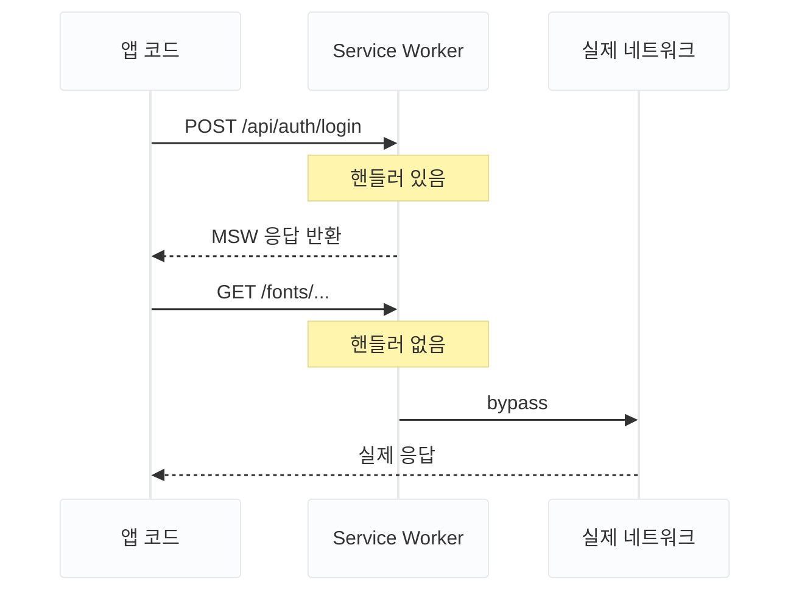

카드 지출 분석 대시보드 **MOA**를 개발하고 있습니다. 로그인, 카드 목록·등록·삭제, 거래 내역, 지출 분석까지 화면마다 서버 응답이 있어야 그릴 수 있는 구조입니다.

MOA는 별도의 백엔드 서버 없이 프론트엔드만으로 완성하는 프로젝트입니다. 그렇다고 컴포넌트에 데이터를 하드코딩하면, 실제 서비스처럼 요청을 보내고 응답을 받아 상태를 관리하는 흐름을 전혀 검증할 수 없습니다. 그래서 **MSW(Mock Service Worker)** 를 백엔드의 대역으로 두기로 했습니다.

이 글은 MSW를 선택한 이유와 동작 원리, 그리고 "실제 API처럼 동작하는 목킹"을 목표로 핸들러를 설계한 과정을 정리한 것입니다.

---

## MSW의 동작 방식

MSW는 브라우저의 **Service Worker API**를 이용해 네트워크 요청을 가로채고, 실제 서버 없이 가짜 응답을 돌려주는 API 목킹 라이브러리입니다. 브라우저뿐 아니라 Node.js 환경도 지원합니다.

핵심은 **가짜 서버를 따로 띄우는 것이 아니라, 진짜 네트워크 레이어에서 요청을 가로챈다**는 것입니다. 앱의 `fetch`/`axios` 코드는 실제 서버와 통신할 때와 완전히 같은 방식으로 요청을 보내고, MSW는 앱 바깥에서 그 요청에 응답합니다. 앱은 자신이 목킹되고 있다는 사실을 모릅니다.

---

## MSW를 선택한 이유

백엔드 없이 개발할 때 흔히 쓰는 방식들과 비교하면 차이가 분명합니다.

| 방식                            | 문제                                                                       |
| ------------------------------- | -------------------------------------------------------------------------- |
| 하드코딩 (`const data = {...}`) | 요청·응답 흐름을 검증할 수 없고, API 연동 시 컴포넌트를 전부 고쳐야 합니다 |
| json-server                     | 별도 서버 프로세스를 띄워야 하고, 인증 같은 로직 표현이 어렵습니다         |
| axios-mock-adapter              | axios에 종속되고, 라이브러리 내부를 대체하는 방식입니다                    |
| `jest.mock('axios')`            | 테스트에서만 동작하고 브라우저 개발에는 쓸 수 없습니다                     |
| **MSW**                         | 네트워크 레이어에서 가로채므로 앱 코드 변경이 없습니다                     |

다른 방식들은 앱 내부의 요청 코드를 가짜로 바꿔치기합니다. 반면 MSW는 앱 코드를 그대로 둔 채 네트워크 바깥에서 응답합니다. 그래서 요청 함수, 인터셉터, 에러 처리까지 **실제 코드 전체가 실행됩니다.**

MSW를 쓰면 얻는 이점은 다음과 같습니다.

- 앱 코드는 `apiClient.post('/auth/login', data)`를 그대로 씁니다. 나중에 실제 서버가 생기면 MSW만 끄면 됩니다
- 브라우저 개발자 도구의 네트워크 탭에서 요청·응답을 직접 확인할 수 있습니다
- 401, 404, 느린 응답 같은 특수 시나리오를 원하는 대로 재현할 수 있습니다

---

## 실무에서의 활용 방식

MSW는 실무에서도 널리 쓰입니다. [kt cloud](https://tech.ktcloud.com/263), [식스샵](https://medium.com/sixshop/%EB%AA%A8%ED%82%B9-%EC%96%B4%EB%96%BB%EA%B2%8C-%ED%95%98%EC%8B%9C%EB%82%98%EC%9A%94-feat-msw-77f530684fda), [매드업](https://tech.madup.com/mock-service-worker/)의 기술 블로그 도입 사례를 보면 쓰임새가 크게 세 가지로 나뉩니다.

**1. 백엔드와의 병렬 개발**

가장 대표적인 용도입니다. 프론트엔드와 백엔드가 API 명세(요청·응답 형태)를 먼저 합의하고, 프론트엔드는 그 명세대로 MSW 핸들러를 만들어 개발을 진행합니다. 실제 API가 완성되면 핸들러만 걷어내면 됩니다. 백엔드를 기다리는 시간과, 연동 후 수정 요청을 주고받는 반복을 줄이기 위해 도입하는 경우가 많습니다.

**2. 테스트에서의 재사용**

MSW는 Node.js 환경에서도 동작하기 때문에, 개발용으로 작성한 핸들러를 테스트 코드에서 그대로 쓸 수 있습니다. 팀원마다 테스트 파일 안에서 같은 API를 각자 목킹하는 중복을 없애고, 목킹 정의를 한 곳에서 관리할 수 있습니다.

**3. 빠른 프로토타이핑과 협업**

개발 초기부터 실제 서비스처럼 동작하는 화면을 만들 수 있어서, 디자이너·기획자에게 일찍 피드백을 받을 수 있습니다. Storybook에서 컴포넌트별로 로딩·에러·빈 데이터 상태를 보여주는 용도로도 쓰입니다.

MOA에서는 1번의 연장선으로 MSW가 백엔드 전체를 대신합니다. 다만 나중에 2번처럼 테스트에서 재사용할 수 있도록 처음부터 구조를 잡아두었습니다.

## 요청을 가로채는 흐름

Service Worker는 웹 앱과 네트워크 사이에서 프록시 역할을 하는 브라우저 기능입니다. 원래는 오프라인 캐싱 등을 위해 만들어졌지만, MSW는 이 "요청을 가로채는 능력"을 목킹에 활용합니다.

앱이 시작될 때 MSW가 Service Worker를 등록하고, 이후 나가는 모든 요청을 핸들러와 매칭해 응답을 결정합니다.



1. 앱이 `fetch` 또는 `axios`로 요청을 보냅니다
2. Service Worker가 요청을 중간에서 가로챕니다
3. 등록된 핸들러와 매칭되면 MSW가 가짜 응답을 반환합니다
4. 핸들러가 없으면 실제 네트워크로 그대로 통과시킵니다

모킹된 요청은 실제 서버로 나가지 않기 때문에 CORS 문제도 발생하지 않습니다.

## 설치와 초기 설정

```bash
npm install msw @faker-js/faker --save-dev
npx msw init public/ --save
```

`msw init`을 실행하면 `public/mockServiceWorker.js` 파일이 생성됩니다. 이 파일이 실제로 브라우저에 등록되는 Service Worker입니다. 라이브러리가 관리하는 파일이므로 직접 수정하지 않습니다.

## 파일 구조

MOA에서는 도메인별로 핸들러를 나누고, 데이터(fixture)와 타입을 분리했습니다.

```
src/
  types/
    card.ts             # CreditCard, CreateCardBody 등 도메인 타입
  lib/
    api-client.ts       # axios 인스턴스 (baseURL: '/api')
  mocks/
    browser.ts          # 브라우저용 워커 설정
    node.ts             # 테스트(Node.js)용 서버 설정
    fixtures/
      cards.ts          # 응답용 초기 데이터
    handlers/
      index.ts          # 도메인별 핸들러 통합
      auth.ts           # 인증
      cards.ts          # 카드
      transactions.ts   # 거래 내역
      analytics.ts      # 지출 분석
public/
  mockServiceWorker.js  # msw init으로 생성된 Service Worker
```

타입을 `mocks/` 밖의 `types/`에 둔 이유는, 이 타입이 목킹 전용이 아니라 앱 전체가 공유하는 API 명세이기 때문입니다. 핸들러와 컴포넌트가 같은 타입을 바라보면, 목 응답이 앱이 기대하는 형태에서 벗어날 때 컴파일 단계에서 드러납니다.

한 가지 짚어둘 점은 경로입니다. 앱 코드에서는 `apiClient.post('/auth/login')`처럼 쓰지만, `apiClient`의 `baseURL`이 `/api`이므로 실제 요청 URL은 `/api/auth/login`이 됩니다. 핸들러는 이 최종 URL을 기준으로 매칭합니다.

## 코드 흐름

### (1) 앱 시작 전 워커 준비 — `src/main.tsx`

```tsx
async function enableMocking() {
  // 백엔드가 없는 데모 배포를 위해 환경 변수로 활성화 여부를 제어
  if (import.meta.env.VITE_ENABLE_MSW !== "true") return;

  const { worker } = await import("./mocks/browser");
  await worker.start({ onUnhandledRequest: "bypass" });
}

// 워커 준비가 끝난 뒤에 앱을 렌더링
enableMocking().then(() => {
  createRoot(document.getElementById("root")!).render(
    <StrictMode>
      <QueryClientProvider client={queryClient}>
        <App />
      </QueryClientProvider>
    </StrictMode>,
  );
});
```

**활성화 조건: `DEV`가 아니라 환경 변수로**

MSW 예제에서는 흔히 `import.meta.env.DEV` 조건을 씁니다. 개발 서버에서만 MSW를 켜고, 프로덕션 빌드에서는 꺼지게 하는 방식입니다.

하지만 MOA에는 백엔드가 없습니다. `DEV` 조건을 쓰면 배포된 데모에서 MSW가 꺼지고, 모든 API 요청이 실패해 화면이 비어버립니다. 그래서 `VITE_ENABLE_MSW`라는 별도 환경 변수로 제어하도록 바꿨습니다.

```bash
# .env.development
VITE_ENABLE_MSW=true

# .env.production — 데모 배포에서도 MSW 사용
VITE_ENABLE_MSW=true
```

나중에 실제 백엔드가 생기면 프로덕션 값만 `false`로 바꾸면 됩니다. 코드 수정 없이 설정만으로 전환할 수 있습니다.

<Callout type="warning">
  MSW로 데모를 배포할 때는 `public/mockServiceWorker.js`가 빌드 결과물에
  포함되어야 합니다. 이 파일이 없으면 워커 등록에 실패해 모든 API 요청이 실제
  네트워크로 나갑니다.
</Callout>

**렌더링 순서: `enableMocking().then(...)`**

이 구조에서 가장 중요한 부분입니다. `worker.start()`는 Service Worker를 등록하고 활성화하는 비동기 작업입니다. 이 작업이 끝나기 전에 앱이 렌더링되면, 앱이 시작되자마자 보내는 요청(예: 토큰 재발급 `/api/auth/refresh`)은 아직 준비되지 않은 워커를 지나쳐 실제 네트워크로 나가버립니다. 백엔드가 없으니 요청은 실패하고, 사용자는 로그인 상태가 풀린 것처럼 보입니다.

`await worker.start()`가 끝난 뒤에만 렌더링을 시작하면, 앱의 첫 요청부터 확실하게 MSW가 받습니다.

**`onUnhandledRequest: 'bypass'`**

핸들러가 없는 요청(폰트, 이미지 등 정적 자원)은 경고 없이 실제 네트워크로 통과시킵니다. 옵션별 차이는 뒤에서 따로 정리했습니다.

### (2) 워커 설정 — `src/mocks/browser.ts`, `src/mocks/node.ts`

```ts
// src/mocks/browser.ts
import { setupWorker } from "msw/browser";
import { handlers } from "./handlers";

export const worker = setupWorker(...handlers);
```

```ts
// src/mocks/node.ts
import { setupServer } from "msw/node";
import { handlers } from "./handlers";

export const server = setupServer(...handlers);
```

브라우저에서는 `setupWorker`가 Service Worker를 통해 요청을 가로채고, Node.js(테스트 환경)에서는 `setupServer`가 같은 역할을 합니다. **두 파일이 같은 `handlers`를 공유**한다는 점이 핵심입니다. 개발 중에 만든 목킹 정의를 테스트에서 다시 작성할 필요가 없습니다.

### (3) 핸들러 통합 — `src/mocks/handlers/index.ts`

```ts
import { authHandlers } from "./auth";
import { cardHandlers } from "./cards";
import { transactionHandlers } from "./transactions";
import { analyticsHandlers } from "./analytics";

export const handlers = [
  ...authHandlers,
  ...cardHandlers,
  ...transactionHandlers,
  ...analyticsHandlers,
];
```

핸들러는 백엔드의 라우터와 같은 역할입니다. 도메인별 파일로 나눠 관리하고, 여기서 하나로 합칩니다.

### (4) 인증 핸들러 — `src/mocks/handlers/auth.ts`

```ts
import { http, HttpResponse } from "msw";

const TEST_EMAIL = "test@moa.dev";
const TEST_PASSWORD = "password123";

export const authHandlers = [
  // 로그인 — 성공 시 토큰, 실패 시 401
  http.post("/api/auth/login", async ({ request }) => {
    const body = (await request.json()) as { email: string; password: string };

    if (body.email === TEST_EMAIL && body.password === TEST_PASSWORD) {
      return HttpResponse.json({ accessToken: "mock-token" });
    }

    return HttpResponse.json(
      { message: "이메일 또는 비밀번호가 올바르지 않습니다." },
      { status: 401 },
    );
  }),

  // 토큰 재발급
  http.post("/api/auth/refresh", () =>
    HttpResponse.json({ accessToken: "mock-token" }),
  ),

  // 로그아웃 — 204 No Content
  http.post("/api/auth/logout", () => new HttpResponse(null, { status: 204 })),
];
```

- `http.post(경로, 핸들러)` — HTTP 메서드와 경로로 요청을 매칭합니다
- `request.json()` — 요청 바디를 읽습니다
- `HttpResponse.json(데이터, { status })` — 상태 코드와 함께 JSON 응답을 반환합니다

로그인 실패 시 실제 서버처럼 401을 돌려주도록 했습니다. 로그아웃은 본문 없는 `204 No Content`로 응답합니다. 덕분에 에러 메시지 표시 같은 실패 UI까지 백엔드 없이 확인할 수 있습니다.

### (5) 초기 데이터 — `src/mocks/fixtures/cards.ts`

핸들러가 사용할 초기 데이터를 fixture로 분리합니다. 현실적인 값을 만들기 위해 **faker** 라이브러리를 사용했습니다.

```ts
import { faker } from "@faker-js/faker/locale/ko";
import type { CreditCard } from "@/types/card";

// 시드를 고정해 새로고침해도 같은 데이터가 생성되도록
faker.seed(123);

export function generateCards(count = 3): CreditCard[] {
  return Array.from({ length: count }, (_, i) => ({
    id: `card_${i + 1}`,
    alias: `내 카드 ${i + 1}`,
    maskedNumber: `**** **** **** ${faker.string.numeric(4)}`,
    isDefault: i === 0,
    // ...
  }));
}

export const FIXTURE_CARDS = generateCards();
```

faker는 기본적으로 호출할 때마다 다른 값을 만듭니다. 새로고침할 때마다 데이터가 바뀌면 화면을 비교하거나 버그를 재현하기 어려워서, `faker.seed()`로 시드를 고정했습니다. 시드는 데이터를 생성하기 전에 설정해야 합니다.

### (6) 카드 핸들러와 인메모리 스토어 — `src/mocks/handlers/cards.ts`

카드는 조회만 하는 것이 아니라 등록·삭제·대표카드 변경이 일어납니다. 이런 CRUD를 표현하기 위해 모듈 스코프 배열을 작은 데이터베이스처럼 사용했습니다.

```ts
import { http, HttpResponse } from "msw";
import type { CreditCard, CreateCardBody } from "@/types/card";
import { FIXTURE_CARDS } from "../fixtures/cards";

// 새로고침 시 초기화되는 인메모리 카드 스토어
let cardStore: CreditCard[] = [...FIXTURE_CARDS];

const notFound = () =>
  HttpResponse.json({ message: "카드를 찾을 수 없습니다." }, { status: 404 });

export const cardHandlers = [
  // 목록 조회
  http.get("/api/cards", () => HttpResponse.json(cardStore)),

  // 등록 — 첫 카드는 자동으로 대표카드
  http.post("/api/cards", async ({ request }) => {
    const body = (await request.json()) as CreateCardBody;
    const newCard: CreditCard = {
      id: crypto.randomUUID(),
      ...body,
      isDefault: cardStore.length === 0,
    };
    cardStore = [...cardStore, newCard];
    return HttpResponse.json(newCard, { status: 201 });
  }),

  // 삭제 — 대표카드를 지우면 남은 첫 카드가 대표카드를 이어받음
  http.delete("/api/cards/:id", ({ params }) => {
    const target = cardStore.find((c) => c.id === params.id);
    if (!target) return notFound();

    cardStore = cardStore.filter((c) => c.id !== params.id);
    if (target.isDefault && cardStore.length > 0) {
      cardStore = cardStore.map((c, i) => ({ ...c, isDefault: i === 0 }));
    }
    return new HttpResponse(null, { status: 204 });
  }),

  // 대표카드 설정
  http.patch("/api/cards/:id/default", ({ params }) => {
    const target = cardStore.find((c) => c.id === params.id);
    if (!target) return notFound();

    cardStore = cardStore.map((c) => ({ ...c, isDefault: c.id === params.id }));
    return HttpResponse.json({ ...target, isDefault: true });
  }),
];
```

**인메모리 스토어**

`let cardStore`를 모듈 스코프에 두면 모든 핸들러가 같은 배열을 공유합니다. 카드를 등록하면 목록 조회 결과에도 바로 반영되므로, 등록 후 목록을 다시 불러오는 캐시 무효화 흐름까지 실제처럼 확인할 수 있습니다. 페이지를 새로고침하면 모듈이 다시 로드되면서 `FIXTURE_CARDS`로 초기화됩니다.

**실제 API처럼 동작하도록**

목킹이 항상 성공 응답만 돌려주면 정상 흐름만 검증됩니다. 그래서 두 가지 규칙을 넣었습니다.

- 없는 카드 ID로 요청하면 404를 반환합니다. 실제 서버라면 당연히 그럴 것이고, 앱의 에러 처리 코드도 이 응답을 받아봐야 검증됩니다
- 대표카드를 삭제하면 남은 카드 중 첫 번째가 대표카드를 이어받습니다. "대표카드가 하나도 없는 상태"라는, 실제 서비스에서는 나올 수 없는 데이터가 만들어지지 않게 하기 위해서입니다

목 데이터가 현실에서 불가능한 상태가 되면, 그 위에서 확인한 UI도 믿을 수 없습니다. 핸들러에도 비즈니스 규칙을 넣은 이유입니다.

### (7) 지연과 에러 재현 — `src/mocks/handlers/transactions.ts`

MSW는 응답을 늦추거나 실패시키는 것도 간단합니다. 로딩 스켈레톤처럼 "느릴 때만 보이는 UI"를 확인할 때 유용합니다.

```ts
import { delay, http, HttpResponse } from "msw";
import { transactionStore } from "../fixtures/transactions";

export const transactionHandlers = [
  http.get("/api/transactions", async () => {
    await delay(1500); // 로딩 스켈레톤 확인용 지연
    return HttpResponse.json(transactionStore);
  }),
];
```

`delay()`에 밀리초를 넘기면 그만큼 응답이 늦어집니다. 인자 없이 호출하면 실제 네트워크와 비슷한 랜덤 지연이 적용됩니다.

서버 에러 화면을 확인하고 싶다면 응답만 바꾸면 됩니다.

```ts
http.get('/api/transactions', () =>
  HttpResponse.json({ message: '일시적인 오류가 발생했습니다.' }, { status: 500 }),
),
```

실제 서버에서는 일부러 500 에러를 만들기 어렵지만, MSW에서는 한 줄로 재현됩니다. 에러 바운더리와 재시도 버튼 같은 예외 UI를 이 방식으로 검증했습니다.

## onUnhandledRequest 옵션

핸들러에 등록되지 않은 요청을 어떻게 처리할지 정하는 옵션입니다.

| 값         | 동작                                                 |
| ---------- | ---------------------------------------------------- |
| `'warn'`   | 실제 네트워크로 통과시키고 콘솔에 경고 출력 (기본값) |
| `'bypass'` | 경고 없이 실제 네트워크로 통과                       |
| `'error'`  | 콘솔에 에러를 출력하고 요청을 실패 처리              |

MOA에서는 폰트·이미지 같은 정적 자원 요청까지 경고가 쌓이지 않도록 `'bypass'`를 썼습니다. 반대로 테스트 환경에서는 `'error'`가 적합합니다. 핸들러를 빠뜨린 API가 있으면 테스트가 조용히 넘어가지 않고 바로 실패하기 때문입니다.

## 다음 단계 — 테스트에서 핸들러 재사용

앞서 `node.ts`를 따로 만들어 둔 이유가 여기에 있습니다. 테스트 설정 파일에서 서버를 켜기만 하면, 개발용 핸들러가 그대로 테스트의 가짜 API가 됩니다.

```ts
// src/test/setup.ts
import { afterAll, afterEach, beforeAll } from "vitest";
import { server } from "@/mocks/node";

beforeAll(() => server.listen({ onUnhandledRequest: "error" }));
afterEach(() => server.resetHandlers()); // 테스트별로 덮어쓴 핸들러 초기화
afterAll(() => server.close());
```

특정 테스트에서만 에러 상황이 필요하면 `server.use()`로 해당 핸들러만 잠시 덮어쓰면 됩니다. 목킹 정의가 한 곳에 모여 있으니, 테스트마다 API 응답을 새로 흉내 낼 필요가 없습니다.

## 정리

| 결정                             | 이유                                         |
| -------------------------------- | -------------------------------------------- |
| 네트워크 레이어 목킹 (MSW)       | 앱 코드 변경 없이 요청·응답 흐름 전체를 검증 |
| 렌더링 전 `await worker.start()` | 앱의 첫 요청부터 가로채기 위해               |
| `VITE_ENABLE_MSW` 환경 변수      | 백엔드 없는 데모 배포에서도 MSW 동작         |
| 타입을 `types/`로 분리           | 목 응답과 앱이 같은 API 명세를 공유          |
| 404·대표카드 이전 규칙           | 현실에서 불가능한 데이터 상태 방지           |
| `browser.ts`/`node.ts` 분리      | 같은 핸들러를 테스트에서 재사용              |

처음에는 "백엔드가 없으니 가짜 데이터가 필요하다"는 단순한 이유로 MSW를 도입했습니다. 하지만 핸들러를 설계하면서, 좋은 목킹은 성공 응답을 돌려주는 것이 아니라 **실제 서버가 할 법한 응답을 모두 돌려주는 것**이라는 걸 알게 됐습니다.

> 좋은 목킹은 성공 응답을 돌려주는 것이 아니라, 실제 서버가 할 법한 응답을 모두 돌려주는 것입니다.
