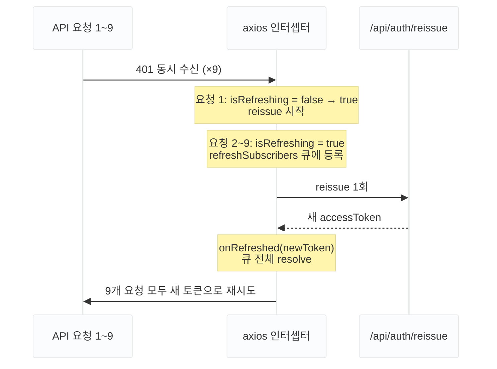

SPA에서 JWT를 쓰면 반드시 부딪히는 문제가 있습니다. B2B 대시보드를 개발하면서 실제로 이 상황을 만났습니다. 대시보드 첫 진입 시 KPI, 예산, 광고, AI 리포트 등 9개 API가 병렬로 발사됩니다. 이때 accessToken이 만료돼 있으면 9개 모두 401을 응답합니다. 각 요청이 독립적으로 재발급을 시도하면 `/api/auth/reissue`가 9번 호출됩니다.

문제는 서버가 refreshToken을 1회 사용 후 무효화한다는 것입니다. 첫 번째 재발급은 성공하지만, 그 순간 refreshToken이 무효화되어 나머지 8번은 실패합니다. 결과는 강제 로그아웃입니다.

## 단순 인터셉터의 한계

가장 흔히 보이는 401 처리 코드는 이렇습니다.

```ts
axiosInstance.interceptors.response.use(
  (response) => response,
  async (error) => {
    if (error.response?.status === 401) {
      const { data } = await reissueToken();
      setAccessToken(data.accessToken);
      return axiosInstance(error.config);
    }
    return Promise.reject(error);
  },
);
```

API가 하나씩 순차적으로 실패할 때는 잘 동작합니다. 그러나 9개가 동시에 401을 받으면 인터셉터도 9번 실행됩니다. 서로의 존재를 모르기 때문에 각자 재발급을 시도합니다.

## 락(Lock) — "1번만 실행"을 보장하는 방법

9개 인터셉터가 동시에 실행되는 상황에서 "재발급은 딱 1번만 실행돼야 한다"는 보장이 필요합니다. 이 보장을 동시성 용어로 **락(Lock)** 이라고 부릅니다.

공중화장실 열쇠 걸이를 상상하면 됩니다.

- 첫 번째 사람이 열쇠를 가져갑니다 — 열쇠가 없어집니다
- 뒤에 온 사람들은 열쇠가 없으니 밖에서 기다립니다
- 첫 번째 사람이 나오면서 열쇠를 반납합니다
- 기다리던 사람들이 순서대로 들어갑니다

`isRefreshing` 플래그가 그 열쇠 역할을 합니다. `true`이면 열쇠가 없는 상태 — 재발급이 이미 진행 중입니다.
나머지 요청들은 큐에 등록돼 대기합니다. 재발급이 끝나면 `onRefreshed`가 큐 전체를 새 토큰으로 깨웁니다.

## 해결: isRefreshing 플래그 + Promise 큐

핵심 아이디어는 두 가지입니다.

1. 첫 번째 401만 재발급을 실행합니다. `isRefreshing` 플래그로 진행 중인 재발급이 있는지 판단합니다.
2. 그 사이에 들어오는 401은 큐에 대기시킵니다. 재발급이 완료되면 큐 전체에 새 토큰을 전달합니다.

```ts
let isRefreshing = false;

interface IRefreshSubscriber {
  resolve: (token: string) => void;
  reject: (error: unknown) => void;
}
let refreshSubscribers: IRefreshSubscriber[] = [];

const onRefreshed = (accessToken: string) => {
  refreshSubscribers.forEach(({ resolve }) => resolve(accessToken));
  refreshSubscribers = [];
};

const onRefreshFailed = (error: unknown) => {
  refreshSubscribers.forEach(({ reject }) => reject(error));
  refreshSubscribers = [];
};
```

`resolve`와 `reject` 쌍을 함께 저장하는 이유는 재발급 실패 시 큐 전체를 reject해야 하기 때문입니다. resolve만 저장하면 실패 경로를 만들 수 없습니다.

## 4가지 케이스 처리

401을 받았을 때 상황은 네 가지로 나뉩니다.

```ts
axiosInstance.interceptors.response.use(
  (response) => response,
  async (error) => {
    const originalRequest = error.config;

    if (error.response?.status === 401) {
      // 케이스 1: accessToken이 없음 → 재발급 시도 없이 즉시 reject
      if (!useAuthStore.getState().accessToken) {
        return Promise.reject(error.response?.data ?? error);
      }

      // 케이스 2: 이미 재발급 중 → 큐에 등록하고 대기
      if (isRefreshing) {
        return new Promise((resolve, reject) => {
          originalRequest._retry = true; // 큐 대기 중 새 토큰도 401이면 무한 루프 방지
          refreshSubscribers.push({
            resolve: (token) => {
              originalRequest.headers.Authorization = `Bearer ${token}`;
              resolve(axiosInstance(originalRequest));
            },
            reject: (err) => reject(err),
          });
        });
      }

      // 케이스 3: _retry 플래그 있음 → 새 토큰으로 재시도했는데 또 401 → 로그아웃
      if (originalRequest._retry) {
        useAuthStore.getState().logout();
        return Promise.reject(error);
      }

      // 케이스 4: 첫 번째 401 → 재발급 실행
      originalRequest._retry = true;
      isRefreshing = true;

      try {
        const { data } = await authInstance.post("/api/auth/reissue");
        const newToken = data.data?.accessToken;
        if (!newToken) throw new Error("토큰 재발급 실패");

        useAuthStore.getState().setAccessToken(newToken);
        onRefreshed(newToken); // 큐 전체 resolve
        originalRequest.headers.Authorization = `Bearer ${newToken}`;
        return axiosInstance(originalRequest);
      } catch (refreshError) {
        onRefreshFailed(refreshError); // 큐 전체 reject
        useAuthStore.getState().logout();
        return Promise.reject(refreshError);
      } finally {
        isRefreshing = false;
        refreshSubscribers = [];
      }
    }

    return Promise.reject(error.response?.data ?? error);
  },
);
```

각 케이스가 필요한 이유를 하나씩 짚으면 다음과 같습니다.

- **케이스 1 — accessToken 없음**: 로그인 전 상태거나 이미 로그아웃된 상태에서 재발급을 시도하면 의미가 없습니다. 즉시 reject합니다.
- **케이스 2 — 이미 재발급 중**: 두 번째 401부터는 이 경로로 들어옵니다. `new Promise`를 반환하면 이 요청은 재발급이 끝날 때까지 pending 상태로 대기합니다. `onRefreshed`가 호출되는 순간 새 토큰을 받아 원래 요청을 재시도합니다. 큐에 넣을 때 `_retry = true`를 설정하는 이유는, 새로 발급받은 토큰으로 재시도했는데 또 401이 오면 다시 케이스 4로 들어가는 무한 루프를 막기 위해서입니다.
- **케이스 3 — 루프 방지**: `_retry` 플래그가 있는 요청이 또 401을 받으면 재시도 없이 로그아웃합니다.
- **케이스 4 — 첫 번째 401**: `isRefreshing = true`로 플래그를 세우고 재발급을 실행합니다. 성공하면 큐에 쌓인 요청들을 모두 새 토큰으로 재시도시키고, 실패하면 모두 reject합니다.

## axios 인스턴스 두 개를 쓰는 이유

```ts
export const axiosInstance = axios.create(baseConfig);
export const authInstance = axios.create({
  ...baseConfig,
  withCredentials: true,
});
```

재발급 요청은 httpOnly 쿠키의 refreshToken을 서버에 전달해야 합니다. `withCredentials: true`가 필요합니다. 단, `withCredentials`는 CORS(Cross-Origin) 요청에서만 의미 있습니다. Vite 프록시를 사용하면 모든 API 요청이 같은 출처로 보이므로 개발 환경에서는 효과가 없습니다. 운영 환경에서 프론트엔드 도메인과 API 도메인이 다를 때 쿠키를 포함하기 위해 설정합니다.

별도 `authInstance`를 만들어 재발급 전용으로 쓰면, 재발급 요청이 `axiosInstance`의 인터셉터를 통과하지 않으므로 케이스 3의 `_retry` 플래그만으로 루프를 안전하게 차단할 수 있습니다.

## 훅 바깥에서 Zustand 스토어에 접근하기

인터셉터는 React 컴포넌트가 아닙니다. `useAuthStore()`를 호출할 수 없습니다. Zustand는 이를 위해 `getState()`를 제공합니다.

```ts
// 컴포넌트 안
const { accessToken } = useAuthStore();

// 인터셉터 안
const token = useAuthStore.getState().accessToken;
```

모듈 레벨에서 스토어 인스턴스에 직접 접근하는 방식입니다. 리렌더링과 무관하게 현재 스토어 값을 읽을 수 있습니다.

## 동작 흐름 요약



실제로 Network 탭에서 확인하면 `/api/auth/reissue`가 정확히 1번만 발생합니다.

## 한 걸음 더 — SSE는 이 인터셉터를 통과하지 않습니다

이 패턴으로 일반 API 호출은 해결됐습니다. 그런데 대시보드에는 실시간 클릭 스트림을 위한 SSE 연결이 3개 있었습니다. SSE는 `fetch` 기반으로 구현되기 때문에 axios 인터셉터를 거치지 않습니다.

세 연결이 동시에 401을 받으면 각자 독립적으로 재발급을 시도합니다. refreshToken은 1회 사용 후 무효화되므로 나머지 두 번은 실패 — 강제 로그아웃으로 이어졌습니다.

한 가지 더, `isRefreshing`(axios 레이어)과 SSE 레이어의 재발급 락은 서로 독립적입니다. axios 401과 SSE 401이 동시에 발생하면 두 레이어가 각자 재발급을 시도합니다. 이를 근본적으로 해결하려면 재발급 로직을 공유 모듈로 추출해 두 레이어가 같은 Promise를 바라보게 해야 합니다.

SSE 포스트에서는 락을 `isRefreshing` boolean 대신 **Promise 자체를 변수에 캐시**하는 방식으로 구현합니다. 차이는 다음과 같습니다.

|                            | boolean 락               | Promise 락               |
| -------------------------- | ------------------------ | ------------------------ |
| "진행 중인가?"             | ✓                        | ✓                        |
| "결과를 기다릴 수 있는가?" | ✗ (subscriber 배열 필요) | ✓ (같은 Promise를 await) |

boolean은 "진행 중이다/아니다"만 알 수 있습니다. 대기 중인 요청들이 결과를 받으려면 subscriber 배열을 별도로 관리해야 합니다. Promise는 진행 중인 작업 자체를 공유합니다. 여러 호출자가 같은 Promise를 `await`하면 결과도 1번만 생산됩니다. SSE는 abort 후 재연결 구조라 subscriber 배열 없이 Promise 하나로 충분합니다. 같은 원리를 fetch 레이어에서 재구현한 이야기는 다음 글에서 이어집니다.

> **MDN 참고**
>
> - [HTTP 401](https://developer.mozilla.org/en-US/docs/Web/HTTP/Status/401)
> - [Authorization 헤더](https://developer.mozilla.org/en-US/docs/Web/HTTP/Headers/Authorization)
> - [withCredentials (XMLHttpRequest)](https://developer.mozilla.org/en-US/docs/Web/API/XMLHttpRequest/withCredentials)
