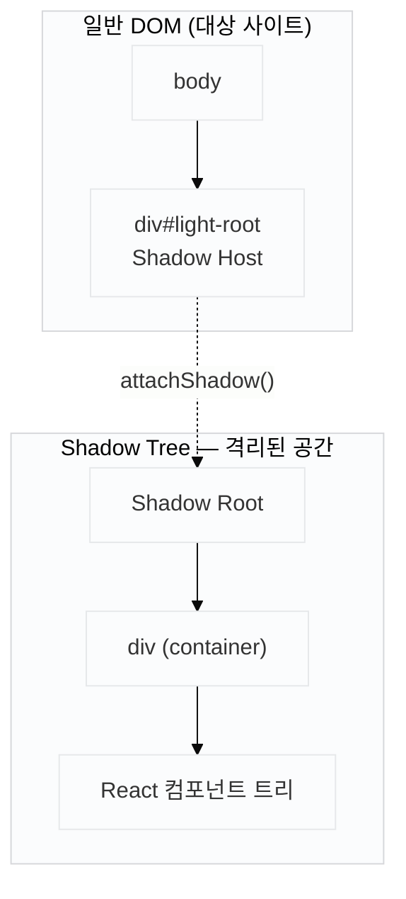

Light는 경제 뉴스 속 금융 용어를 자동 감지해 툴팁으로 보여주는 Chrome 확장 프로그램입니다. 콘텐츠 스크립트에서 React 컴포넌트를 타사 페이지에 주입하는 구조입니다.

처음 구현은 단순했습니다.

```tsx
const container = document.createElement('div')
document.body.appendChild(container)
ReactDOM.createRoot(container).render(<TooltipLayer />)
```

로컬에서 빈 HTML로 테스트하면 잘 동작합니다. 그런데 네이버 뉴스, 조선일보 같은 실제 사이트에서 실행하면 툴팁 폰트가 대상 사이트 폰트로 바뀌거나, z-index가 묻혀 다른 요소 뒤에 숨거나, 레이아웃이 완전히 무너졌습니다.

원인은 전역 CSS 오염입니다.

## CSS가 침범하는 이유

브라우저는 DOM 트리 전체에 스타일시트를 적용합니다. 익스텐션이 주입한 `div`도 대상 사이트 DOM의 자식이므로, 사이트의 `*`, `body`, `div` 등 글로벌 셀렉터가 그대로 영향을 미칩니다.

```css
/* 대상 사이트 CSS — 전혀 무관한 컴포넌트에도 적용됨 */
* { box-sizing: border-box; font-family: 'Noto Sans KR', sans-serif; }
div { position: relative; }
```

인터파크 같은 오래된 커머스 사이트는 전역 스타일이 특히 공격적입니다. `font-size`, `line-height`, `color`를 `*` 셀렉터로 강제하는 경우가 많습니다.

## Shadow DOM이란

Shadow DOM은 브라우저가 DOM 트리 안에 만들 수 있는 **격리된 하위 트리**입니다. 일반 DOM과 달리 외부의 CSS 선택자가 내부 요소를 대상으로 삼지 못합니다.

사실 브라우저 기본 요소들이 이미 Shadow DOM을 사용하고 있습니다. `<input type="range">`의 슬라이더 트랙, `<video>`의 재생 버튼과 볼륨 바가 일반 CSS로 스타일을 바꾸기 어려운 이유가 바로 Shadow DOM 안에 구현돼 있기 때문입니다. DevTools에서 "Show user agent shadow DOM" 옵션을 켜면 이 내부 구조를 직접 확인할 수 있습니다.

구성 요소는 세 가지입니다.

| 용어 | 역할 |
|------|------|
| **Shadow Host** | 일반 DOM에 존재하는 평범한 요소. Shadow Tree를 품고 있는 겉모습 |
| **Shadow Root** | `attachShadow()`로 생성되는 Shadow Tree의 시작점 |
| **Shadow Boundary** | Shadow Root와 외부 DOM 사이의 경계. CSS 선택자가 이 선을 넘지 못함 |

아파트 비유로 생각하면 이렇습니다. 단지 공용 방송(전역 CSS)은 모든 세대에 울려 퍼지지만, 각 세대의 내부 인테리어(Shadow Tree 안 스타일)는 서로 간섭하지 않습니다. Shadow Host가 현관문, Shadow Root가 세대 내부입니다.



일반 DOM 안의 요소는 대상 사이트 CSS에 영향을 받습니다. Shadow Root 아래의 요소는 받지 않습니다. 이 경계를 **Shadow Boundary**라고 부릅니다.

## 해결: Shadow DOM으로 스타일 격리

Shadow DOM은 DOM의 캡슐화 단위입니다. 외부 CSS 선택자가 Shadow Root 안쪽 요소를 대상으로 삼는 것을 막습니다. 반대로 Shadow Root 안에 작성한 스타일은 바깥 DOM을 오염시키지 않습니다.

단, `font-family`, `color`, `line-height` 같은 **상속 속성(inherited properties)** 은 Shadow Boundary를 넘어 전파됩니다. 부모 문서에서 상속된 스타일이 Shadow Root 안쪽 요소에도 영향을 줄 수 있습니다. 이를 차단하려면 `:host { all: initial; }`로 초기화해야 합니다. 또한 `rem` 단위는 문서 루트(`html`)의 `font-size`에 영향을 받으므로, 대상 사이트가 `html { font-size: 62.5% }`를 쓰는 경우 의도치 않은 크기가 됩니다.

```css
:host {
  all: initial;        /* 상속 속성 초기화 */
  display: block;
  font-family: sans-serif;
  font-size: 16px;     /* rem 기준값 명시 */
}
```

```tsx
// content script
const host = document.createElement('div')
document.body.appendChild(host)

const shadowRoot = host.attachShadow({ mode: 'open' })

const container = document.createElement('div')
shadowRoot.appendChild(container)

ReactDOM.createRoot(container).render(<TooltipLayer />)
```

`attachShadow({ mode: 'open' })`로 Shadow Root를 생성하고, 그 안에 container를 넣습니다. React는 container를 루트로 삼아 렌더링합니다.

## Emotion 문제: 스타일이 Shadow Root 바깥으로 나간다

Emotion은 기본적으로 `<head>`에 `<style>` 태그를 삽입합니다. Shadow DOM 안 컴포넌트에서 Emotion CSS를 쓰면 스타일 태그는 `<head>`에 붙고, 컴포넌트는 Shadow Root 안에 있습니다.

`<head>`의 스타일시트는 Shadow Root 안으로 들어가지 않습니다. CSS가 적용되지 않아 스타일 없는 날것의 HTML이 됩니다.

해결책은 Emotion 캐시의 삽입 대상을 Shadow Root로 바꾸는 것입니다.

```tsx
import createCache from '@emotion/cache'
import { CacheProvider } from '@emotion/react'

const shadowCache = createCache({
  key: 'light',
  container: shadowRoot,   // <style> 태그가 여기 붙는다
})

ReactDOM.createRoot(container).render(
  <CacheProvider value={shadowCache}>
    <TooltipLayer />
  </CacheProvider>
)
```

`createCache`의 `container` 옵션에 Shadow Root를 넘기면 Emotion이 Shadow Root 안에 `<style>` 태그를 삽입합니다. CSS와 컴포넌트가 같은 Shadow Root 안에 있으므로 정상적으로 적용됩니다.

## 전체 마운트 코드

```tsx
// src/content/mount.tsx
import React from 'react'
import ReactDOM from 'react-dom/client'
import createCache from '@emotion/cache'
import { CacheProvider } from '@emotion/react'
import { TooltipLayer } from './TooltipLayer'

export function mountTooltipLayer() {
  const host = document.createElement('div')
  host.id = 'light-extension-root'
  document.body.appendChild(host)

  const shadowRoot = host.attachShadow({ mode: 'open' })

  const container = document.createElement('div')
  shadowRoot.appendChild(container)

  const emotionCache = createCache({
    key: 'light',
    container: shadowRoot,
  })

  ReactDOM.createRoot(container).render(
    <CacheProvider value={emotionCache}>
      <TooltipLayer />
    </CacheProvider>
  )
}
```

## 이벤트는 Shadow Root 바깥에 붙입니다

툴팁은 마우스 오버 이벤트로 트리거됩니다. Shadow Root 안의 요소에서 발생한 이벤트가 Shadow Boundary 밖으로 전파될 때, `event.target`이 Shadow Root 내부 요소에서 Shadow Host로 교체됩니다(retargeting). 외부에서는 이벤트의 실제 원인 요소를 알 수 없게 됩니다.

이 구조에서는 이벤트 리스너를 Shadow Root 바깥(`document`)에 붙이고, 감지된 요소 좌표를 Shadow Root 안의 React 상태로 전달하는 방식이 깔끔합니다.

```ts
// 이벤트 감지 — Shadow Root 바깥
document.addEventListener('mouseover', (e) => {
  const target = e.target as HTMLElement
  const span = target.closest('[data-light]')
  if (span) {
    tooltipStore.show(span.getBoundingClientRect())
  }
})
```

```tsx
// 렌더링 — Shadow Root 안
function TooltipLayer() {
  const { visible, rect } = useTooltipStore()
  if (!visible) return null
  // getBoundingClientRect()는 뷰포트 기준 좌표를 반환한다.
  // position: fixed 없이 top/left를 쓰면 스크롤 위치에 따라 어긋난다.
  return <Tooltip style={{ position: 'fixed', top: rect.top, left: rect.left }} />
}
```

이벤트 레이어와 렌더 레이어를 분리하면 Shadow Boundary 이벤트 retargeting 이슈를 피할 수 있습니다.

## mode: 'open' vs 'closed'

`attachShadow`의 `mode` 옵션은 두 가지입니다.

| mode | 설명 |
|------|------|
| `'open'` | `host.shadowRoot`로 외부에서 접근 가능 |
| `'closed'` | `host.shadowRoot`가 null — 외부 접근 불가 |

익스텐션 콘텐츠 스크립트에서는 `'open'`이 디버깅하기 편합니다. DevTools에서 Shadow Root 내부 요소를 선택하고 스타일을 검사할 수 있습니다. 보안상 중요한 UI라면 `'closed'`를 쓰지만, 콘텐츠 스크립트 수준에서 클로즈드 모드가 제공하는 보안 이점은 제한적입니다.

## 회고

처음에는 Shadow DOM 하나면 충분하다고 생각했습니다. `attachShadow`를 붙이면 CSS 문제가 깔끔하게 끝날 줄 알았습니다. 그런데 수정할 때마다 다음 레이어가 드러났습니다.

Shadow DOM으로 선택자 오염을 막았더니 상속 속성이 여전히 넘어왔습니다. `:host { all: initial }`로 초기화했더니 Emotion 스타일이 사라졌습니다. `createCache`로 삽입 위치를 바꿨더니 이번엔 이벤트 retargeting 문제가 생겼습니다.

각 단계에서 "이제 됐다"고 느꼈다가 다음 문제를 만나는 패턴이 반복됐습니다. 돌아보면 당연한 구조였습니다. 격리가 필요한 레이어가 세 곳이었으니까요.

- **DOM 구조** — `attachShadow`로 선택자 격리
- **CSS 상속** — `:host { all: initial }`로 전파 차단
- **CSS-in-JS 런타임** — `createCache`로 스타일 주입 위치 변경

처음부터 이 세 레이어를 순서대로 풀어야 한다고 인식했다면 훨씬 빠르게 해결했을 것입니다. 하지만 그러려면 Shadow DOM이 "무엇을 막고 무엇을 막지 않는지"를 미리 알고 있어야 했습니다. 직접 부딪히기 전까지는 상속 속성이 Shadow Boundary를 넘는다는 사실도, Emotion이 `<head>`에 스타일을 심는다는 사실도 의식하지 않았습니다.

이 경험 이후로 "격리"를 구현할 때 무엇을 격리하는지를 먼저 물어보게 됐습니다. 선택자인지, 상속인지, 런타임 동작인지. 한 단어로 부르는 격리가 실제로는 여러 레이어에 걸쳐 있을 때 빠진 레이어가 버그가 됩니다.
