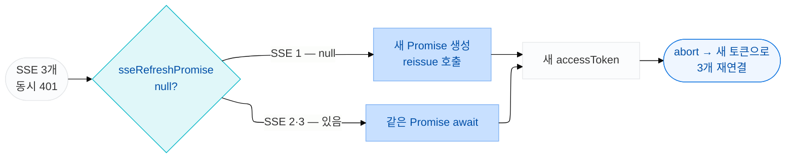

axios 인터셉터로 병렬 401 큐 패턴을 구현한 뒤 한동안 인증이 안정적으로 동작했습니다. 그러다 Sentry에서 예상 밖의 에러가 잡혔습니다. 특정 사용자가 대시보드에 진입하면 드물게 강제 로그아웃되는 패턴이었습니다.

Network 탭을 확인하니 `/api/auth/reissue`가 3번 연달아 호출되고 있었습니다. 세 번째 요청부터는 401을 응답했습니다. 원인은 SSE였습니다.

Sentry를 더 들여다보니 문제는 하나가 아니었습니다. 토큰 중복 재발급으로 인한 강제 로그아웃이 첫 번째, `onerror`에서 발생한 unhandled promise rejection이 두 번째였습니다. 이 글은 두 문제를 모두 해결한 과정을 다룹니다.

## SSE는 axios 인터셉터를 통과하지 않는다

`@microsoft/fetch-event-source` 라이브러리는 `fetch` API 기반입니다. axios로 감싸지 않기 때문에 인터셉터가 전혀 개입하지 못합니다. 401을 받아도 큐에 등록되지 않습니다.

대시보드에는 실시간 클릭 스트림을 위한 SSE 연결이 3개 있었습니다. `AllPlatformTrafficChart` 컴포넌트 하나가 채널별로 3개의 SSE를 열었습니다. 세 연결이 동시에 401을 받으면 각자가 독립적으로 재발급을 시도합니다.

서버는 refreshToken을 1회 사용 후 무효화합니다. 첫 번째 재발급은 성공하고, 나머지 두 번은 401을 받습니다. 두 번째·세 번째 재발급 실패 → 로그아웃.

## 기본 EventSource를 쓰지 않은 이유

`EventSource`는 브라우저 내장 API로 SSE를 간편하게 연결할 수 있습니다. 그러나 `Authorization` 헤더를 지원하지 않습니다. 커스텀 헤더를 전혀 설정할 수 없는 구조입니다.

대시보드는 Bearer 토큰으로 인증합니다. accessToken을 `Authorization` 헤더로 보내야 하므로 `EventSource`를 쓸 수 없습니다. `@microsoft/fetch-event-source`를 사용한 이유입니다. 이 라이브러리는 `fetch`를 기반으로 하므로 헤더를 자유롭게 설정할 수 있습니다.

```ts
fetchEventSource(url, {
  headers: {
    Authorization: `Bearer ${accessToken}`,
  },
  onopen: async (response) => { ... },
  onmessage: (event) => { ... },
})
```

## 해결: sseRefreshPromise 싱글턴

axios 인터셉터에서 `isRefreshing` 플래그로 해결한 것과 같은 원리입니다. SSE 레이어에서도 "재발급이 진행 중이면 그 Promise를 공유하고, 새로 시작하지 않는다"는 보장이 필요합니다.

`isRefreshing`은 boolean이었습니다. SSE에서는 Promise 자체를 공유해 대기할 수 있도록 Promise를 변수에 캐시하는 방식을 사용했습니다.

```ts
// sse-client.ts — 모듈 레벨 싱글턴
let sseRefreshPromise: Promise<string | null> | null = null

async function refreshTokenOnce(): Promise<string | null> {
  if (sseRefreshPromise) return sseRefreshPromise   // 이미 진행 중이면 같은 Promise 반환

  sseRefreshPromise = reissueToken()
    .then((r) => r.data?.accessToken ?? null)
    .catch(() => null)
    .finally(() => {
      sseRefreshPromise = null   // 완료되면 초기화 — 다음 재발급은 새 Promise
    })

  return sseRefreshPromise
}
```

`sseRefreshPromise`가 null이면 새 재발급 Promise를 만들어 저장합니다. null이 아니면 이미 진행 중인 Promise를 그대로 반환합니다. 3개의 SSE 연결이 동시에 `refreshTokenOnce()`를 호출해도 Promise는 하나입니다.

## onopen에서 401 처리

```ts
onopen: async (response) => {
  if (response.status === 401) {
    const newToken = await refreshTokenOnce()

    if (newToken) {
      useAuthStore.getState().setAccessToken(newToken)
    } else {
      useAuthStore.getState().logout()
    }

    controller.abort()   // throw가 아니라 abort
    return
  }

  if (!response.ok) {
    throw new Error(`SSE 연결 실패: ${response.status}`)
  }
},
```

`controller.abort()`와 `throw`의 차이가 중요합니다.

- `throw`: `fetchEventSource` 내부에서 에러로 처리됩니다. 라이브러리의 재연결 로직이 작동하거나, unhandled rejection으로 Sentry에 에러가 잡힙니다
- `abort()`: 연결을 정상 종료합니다. 재연결 로직이 트리거되지 않고, Sentry에도 노이즈가 없습니다

401은 에러가 아니라 토큰 갱신 후 재연결이 필요한 상태입니다. 그래서 `abort()`를 선택했습니다.

## caller 측에서 새 토큰으로 재연결하기

`abort()` 후 caller 측이 새 accessToken으로 SSE를 다시 열어야 합니다. `accessToken`을 `useEffect` 의존성에 넣으면 토큰이 바뀔 때마다 자동으로 재연결됩니다.

```tsx
const { accessToken } = useAuthStore()

useEffect(() => {
  if (!accessToken) return

  const controller = new AbortController()

  fetchEventSource(sseUrl, {
    headers: { Authorization: `Bearer ${accessToken}` },
    signal: controller.signal,
    onopen: async (response) => {
      if (response.status === 401) {
        const newToken = await refreshTokenOnce()
        if (newToken) {
          useAuthStore.getState().setAccessToken(newToken)
          // setAccessToken → accessToken 변경 → useEffect 재실행 → 새 연결
        } else {
          useAuthStore.getState().logout()
        }
        controller.abort()
        return
      }
      if (!response.ok) throw new Error(`SSE 연결 실패: ${response.status}`)
    },
    onmessage: (event) => { /* ... */ },
  })

  return () => controller.abort()
}, [accessToken])
```

`setAccessToken(newToken)`이 호출되면 `accessToken`이 바뀌고, `useEffect`가 재실행되어 새 토큰으로 SSE 연결을 다시 엽니다.

## onerror — throw 대신 abort로 unhandled rejection 제거

`onopen` 401 처리가 해결됐지만 Sentry에는 또 다른 패턴의 에러가 남아있었습니다. `fetchEventSource` 내부에서 발생하는 unhandled promise rejection이었습니다.

기존 `onerror`를 보면 MAX_RETRIES 초과 시 `throw err`로 에러를 다시 던집니다.

```ts
onerror(err) {
  retryCountRef.current += 1;
  if (retryCountRef.current >= MAX_RETRIES) {
    setIsError(true);
    throw err;  // fetchEventSource 내부 Promise가 reject → unhandled rejection
  }
}
```

`fetchEventSource`의 `onerror` 안에서 `throw`하면 라이브러리의 내부 Promise 전체가 reject됩니다. 이 Promise를 호출 측에서 별도로 catch하지 않으면 unhandled promise rejection이 되어 Sentry에 에러가 쌓입니다.

`throw err` 대신 `controller.abort()`를 호출하면 됩니다. abort는 정상 종료이므로 에러로 전파되지 않습니다.

```ts
onerror(err) {
  retryCountRef.current += 1;
  if (retryCountRef.current >= MAX_RETRIES) {
    setIsError(true);
    controller.abort();  // throw 대신 abort → unhandled rejection 없이 연결 종료
    return;
  }
}
```

## AbortError를 onerror에서 구분해야 하는 이유

`onopen`에서 `controller.abort()`를 호출하면 `onerror`가 `DOMException(AbortError)`를 받습니다. `fetchEventSource`는 abort를 감지하면 내부적으로 AbortError를 throw하고, 이것이 `onerror`로 전달되기 때문입니다.

AbortError를 별도로 처리하지 않으면 예상치 못한 흐름이 생깁니다.

- `retryCountRef.current`가 증가합니다
- MAX_RETRIES에 도달하면 `setIsError(true)`가 실행됩니다
- 401 재발급 후 정상적인 재연결 시나리오인데 에러 상태로 처리되는 모순이 생깁니다

```ts
onerror(err) {
  // abort() 호출로 인한 정상 종료 — 재시도 없이 무시
  if (err instanceof DOMException && err.name === "AbortError") return;

  retryCountRef.current += 1;
  if (retryCountRef.current >= MAX_RETRIES) {
    setIsError(true);
    controller.abort();
    return;
  }
}
```

이 두 수정으로 `onerror`가 다루는 케이스가 명확히 분리됩니다.

| 상황 | 처리 |
|------|------|
| abort()로 인한 AbortError | 무시 (정상 종료) |
| 네트워크 에러 (MAX_RETRIES 미만) | retryCount 증가, 라이브러리 기본 재시도 |
| 네트워크 에러 (MAX_RETRIES 초과) | `setIsError` + abort (unhandled rejection 없이 종료) |

## axios 레이어와 락 공유

`isRefreshing`(axios)과 `sseRefreshPromise`(SSE)는 서로 다른 락입니다. axios 401과 SSE 401이 동시에 발생하면 두 레이어가 각자 재발급을 시도합니다.

이를 근본적으로 해결하려면 재발급 함수를 공유 모듈로 추출합니다.

```ts
// lib/refreshTokenOnce.ts
let promise: Promise<string | null> | null = null

export function refreshTokenOnce(): Promise<string | null> {
  if (promise) return promise
  promise = authInstance.post('/api/auth/reissue')
    .then((r) => r.data?.data?.accessToken ?? null)
    .catch(() => null)
    .finally(() => { promise = null })
  return promise
}
```

axios 인터셉터와 SSE 클라이언트 모두 이 함수를 import해 사용하면, 어느 레이어에서 먼저 재발급을 시작하든 Promise는 하나로 공유됩니다.

## 동작 흐름



## axios 큐 패턴과의 비교

두 패턴은 같은 문제를 해결하지만 구현 형태가 다릅니다.

| 구분 | axios 인터셉터 | SSE sseRefreshPromise |
|------|---------------|----------------------|
| 재발급 제어 방식 | `isRefreshing` boolean 플래그 | Promise 캐싱 싱글턴 |
| 대기 방식 | `new Promise(resolve, reject)`를 큐에 push | 같은 Promise를 `await` |
| 실패 처리 | `onRefreshFailed`로 큐 전체 reject | `catch(() => null)`로 null 반환 후 logout |
| 완료 후 정리 | `isRefreshing = false`, `refreshSubscribers = []` | `finally(() => sseRefreshPromise = null)` |

axios 큐 패턴은 대기 중인 요청을 모아뒀다가 새 토큰으로 재시도시켜야 하므로 subscriber 배열이 필요합니다. SSE는 abort 후 caller가 재연결을 담당하므로 Promise 하나만 공유하면 됩니다. 더 단순한 구조가 나옵니다.

## Sentry로 발견한 이유

이 버그는 QA 중에는 재현되지 않았습니다. QA 시나리오가 단일 SSE 연결로만 테스트했기 때문입니다. 실제 사용자 환경에서 대시보드에 여러 SSE가 동시에 열리는 시나리오가 되어서야 강제 로그아웃이 발생했습니다.

Sentry에 `reissue 401` 에러가 올라오지 않았다면 찾기 어려운 버그였습니다. 이 계기로 재발급 실패를 `captureException`으로 기록하도록 axios 에러 핸들러를 보완했습니다. reissue가 401을 받을 때마다 Sentry에 이벤트가 쌓이면서, 이후에도 유사한 패턴의 버그를 빠르게 발견할 수 있게 됐습니다.

**MDN 참고**
- [`EventSource`](https://developer.mozilla.org/en-US/docs/Web/API/EventSource)
- [`AbortController`](https://developer.mozilla.org/en-US/docs/Web/API/AbortController)
- [`Authorization` 헤더](https://developer.mozilla.org/en-US/docs/Web/HTTP/Headers/Authorization)

## 관련 PR

- [**[Bugfix/#352] SSE 연결 중 accessToken 만료 시 401 자동 갱신 및 Sentry 에러 전파 방지**](https://github.com/WhereYouAd/WhereYouAd-Frontend/pull/353)  
  `src/hooks/dashboard/useClickStream.ts` — `sseRefreshPromise` 싱글턴 추가, onopen 401 처리, onerror AbortError 분기 및 MAX_RETRIES 초과 시 abort 전환
